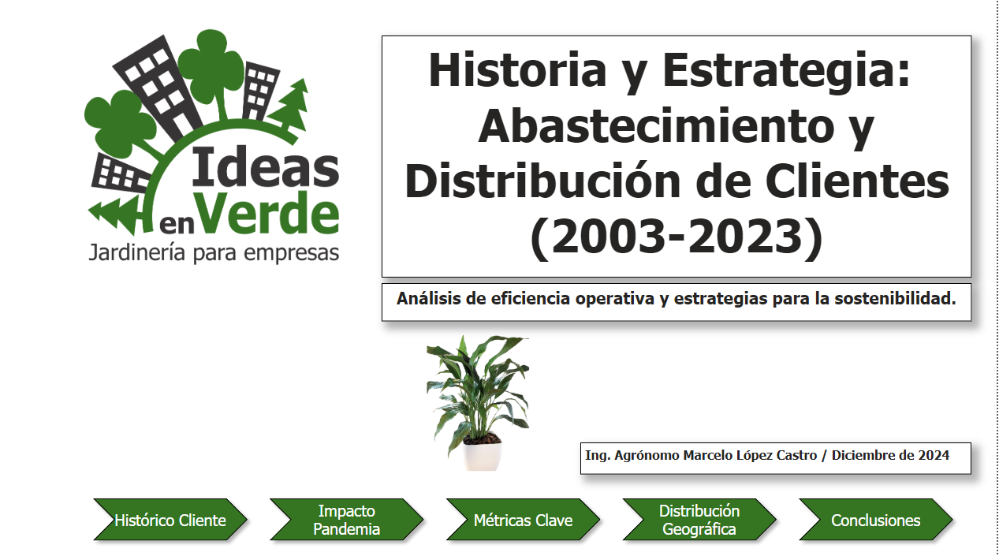
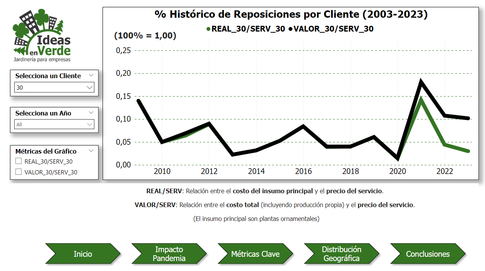
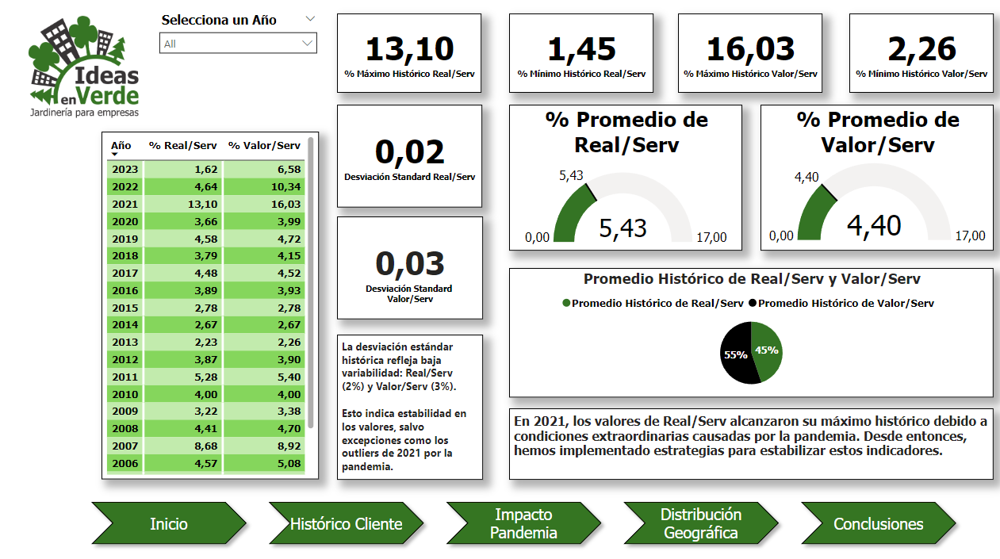
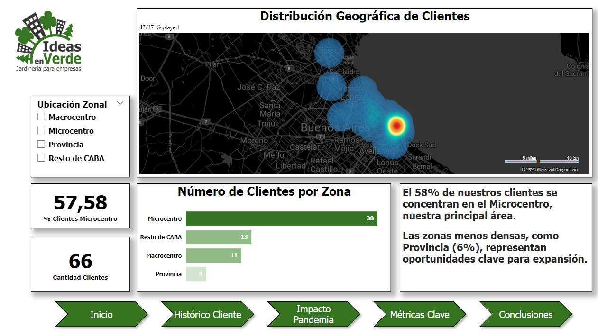
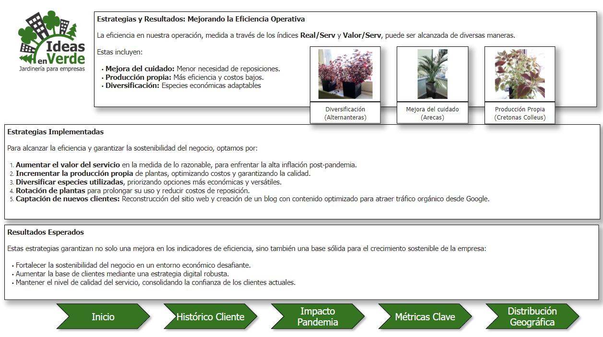

# **Ideas-en-Verde Optimization** 🌿  

### **Análisis de Eficiencia Operativa y Estrategias de Optimización (2003-2024)**  

## **Descripción del Proyecto**  

En este proyecto se analiza la eficiencia operativa de **Ideas en Verde - Jardinería para Empresas** a lo largo de un período de 20 años (2003-2024).  

El enfoque principal es evaluar y optimizar indicadores clave relacionados con:  

- **Porcentaje de reposición de plantas**: Real/Serv.  
- **Monto facturado del servicio**: Valor/Serv.  

El proyecto demuestra cómo la pandemia de COVID-19 afectó significativamente la eficiencia de la empresa, llevando los indicadores a niveles históricos bajos, y detalla las medidas implementadas para revertir esta situación y alcanzar valores récord históricos.  

---

## **Datos Utilizados**  

Los datos incluyen:  

- **Costo de adquisición de plantas:** La suma de los costos asociados a la compra de plantas para los servicios.  
- **Valor total de plantas:** Incluye tanto el costo de adquisición como el valor de las plantas producidas de forma interna o recuperadas.  

### **Periodo Analizado:**  

2003 - 2023.

---

## **Objetivos del Proyecto**  

1. **Identificar tendencias históricas** de eficiencia operativa utilizando métricas clave.  
2. **Evaluar el impacto de la pandemia** en los indicadores de la empresa.  
3. **Implementar estrategias basadas en datos** para superar las métricas históricas y mejorar la sostenibilidad operativa.  

---

## **Metodología**  

1. **Limpieza y Transformación de Datos**:  
   - Los datos originales provienen de 21 tablas anuales en Excel.  
   - Se consolidaron en una tabla maestra larga y tablas auxiliares.  

2. **ETL Process (Extract, Transform, Load)**:
   
   - Conversión de archivos Excel a CSV.  
   - Creación de una base de datos relacional en SQL Server.  

4. **Visualizaciones Iniciales**:
   
   - Gráficos preliminares en Python utilizando pandas, matplotlib, y Jupyter Notebook.  

6. **Análisis Visual y Estratégico**:
   
   - Dashboards interactivos desarrollados en Power BI, con filtros y segmentaciones dinámicas.  

---

## **Resultados Clave**  

- 📉 **Impacto de la Pandemia:** En 2021, la tasa de reposición alcanzó un máximo histórico (16.03%).  
- 📈 **Mejoras Implementadas:** Producción propia, diversificación de especies económicas, y estrategias digitales permitieron reducir el porcentaje de reposición a niveles récord (5.43%).  
- 🌎 **Análisis Geográfico:** El 58% de los clientes están concentrados en el Microcentro, identificando oportunidades de expansión en zonas menos densas.  

---

## **Herramientas y Tecnologías Utilizadas**  

- **Excel:** Limpieza y estructuración inicial de datos.  
- **SQL Server:** Creación y consulta de base de datos.  
- **Python:** Visualizaciones iniciales con matplotlib, pandas, y Jupyter Notebook.  
- **Power BI:** Dashboards interactivos para análisis y storytelling.  

---

## **Estrategias Implementadas**  

1. **Producción Propia de Plantas:** Reducción de costos mediante la producción interna.  
2. **Diversificación de Especies:** Uso de plantas económicas y adaptables.  
3. **Captación de Nuevos Clientes:** Optimización del sitio web y creación de un blog para atraer tráfico orgánico.  
4. **Rotación de Plantas:** Aumento de la vida útil y reducción de reposiciones.  

---

## **Cómo Ejecutar el Proyecto**  

1. Clonar este repositorio:  
   ```bash
   git clone https://github.com/tu-usuario/Ideas-en-Verde-Optimization.git
   ```  
2. Instalar las dependencias necesarias para Python.  
3. Configurar la conexión a SQL Server con los datos de la base proporcionada.  
4. Revisar los dashboards de Power BI para analizar las métricas clave.

---

## **Contact Information**  

Este proyecto fue desarrollado por [Tu Nombre](https://www.linkedin.com/in/tu-usuario).  
¿Tienes preguntas o comentarios? ¡No dudes en contactarme! 🚀  

---

## Dashboard Overview

This dashboard provides an overview of Real/Serv and Valor/Serv metrics across the 20-year period.
Vista General del Dashboard
Este dashboard proporciona una visión general de los indicadores clave Real/Serv y Valor/Serv a lo largo de un período de 20 años (2003-2023).

## Historical Trends

Visualization of historical trends for plant replenishment rates and service values.

## Pandemic Impact Analysis

Detailed insights into the operational challenges and recovery strategies during the COVID-19 pandemic.

## KPIs Summary

Key performance indicators for efficiency and cost optimization.

## Geographic Distribution

Heatmap showing client distribution in different regions.

## Conclusions and Insights

Final conclusions and actionable insights derived from the analysis.

